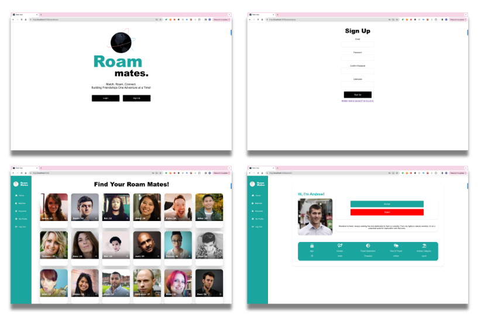
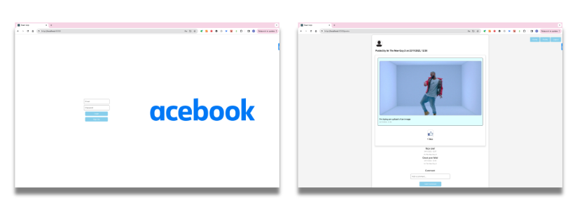
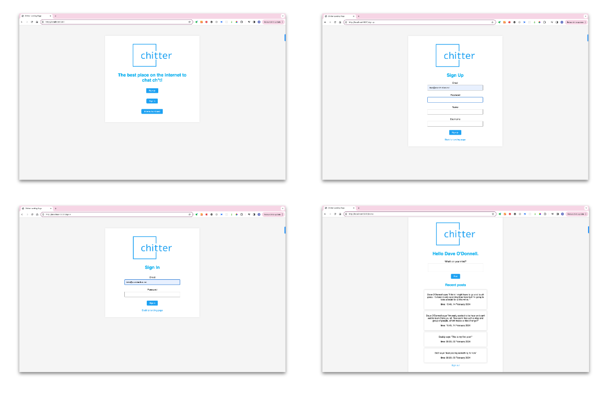

# Hi there 👋 

## I'm Dave, a London-based developer, with a focus on back-end development.

From March - July 2024, I worked as a full-stack developer for micro-mobility start up, Ventete, working predominantly on web development and 3rd party API integrations. I oversaw their migration from a Wordpress/PHP build to a Shopify build through June / July.

In January 2024, I completed a 4 month Makers Bootcamp - taking the specialist track in software development. Beyond the fundamentals of Python and Javascript, the bootcamp focused on the Golden Square principles (test driven development, object-oriented design, debugging and pair programming), alongside best practices for the design and building of databases and web applications.

Prior to Makers, in the summer of 2023 I participated in Stanford's annual 8-week Code In Place course.

## Languages, frameworks, libraries and web technologies I've used: 

  <table style="margin:auto; border-collapse: collapse; width:100%;">
<tr>
<td style="text-align:center; vertical-align:top; padding:10px; font-weight: bold; font-size:18px">Python</td>
<td style="text-align:center; vertical-align:top; padding:10px; font-weight: bold; font-size:18px">Javascript</td>
<td style="text-align:center; vertical-align:top; padding:10px; font-weight: bold; font-size:18px">Databases</td>
<td style="text-align:center; vertical-align:top; padding:10px; font-weight: bold; font-size:18px">Web Technologies</td>
</tr>

<tr>
<td style="text-align:left; vertical-align:top; padding:10px;">

- Flask
- Django
- Jinja
- Playwright
- Pytest

</td>
<td style="text-align:left; vertical-align:top; padding:10px;">

- Express
- Node.js
- React
- Jest
- Cypress
- Playwright

</td>
<td style="text-align:left; vertical-align:top; padding:10px;">

- PostgreSQL
- MongoDB

</td>
<td style="text-align:left; vertical-align:top; padding:10px;">

- CSS
- Git
- HTML
- HTTP
- REST APIs

</td>
</tr>
  </table>

## Current Projects 💻
I'm building a 7-aside football administration app, using Python, PostgreSQL, Flask, JWT, and React. 
I'm also learning Django and Django REST framework, to speed up project development!

## My Makers Projects 💻
### [Roam Mates](https://github.com/SoundMotives/RoamMates)
Roam Mates “connects like-minded travellers to explore the world! together” 
We implemented a Python backend using Flask and PostgreSQL, with a Javascript and React frontend using JWT authentication. Collaboration was managed using Git, and testing was conducted using Pytest, Cypress and Playwright. Quality Engineer collaboration ensured the team built better software, and we learned a lot!

### [AceBook](https://github.com/SoundMotives/AceBook)
AceBook was built using the MERN stack (MongoDB, Express, React and Node.js). Collaboration was managed using Git, and testing was conducted using Cypress and Playwright. 

### MakersBnB
MakersBNB is an AirBnB clone, built using Python, Flask, PostgreSQL. Collaboration was managed using Git, and testing was conducted using Pytest.

### [Chitter](https://github.com/SoundMotives/Chitter)
Chitter is a Twitter clone, built using Python, Flask, Jinja, PostgreSQL, CCS, HTML and HTTP. Chitter uses session-based authentication for users to access authenticated pages. 

### [Paper Scissors Stone](https://github.com/SoundMotives/PaperScissorsStone)
A simple web app of the Paper Scissors Stone game. It's an excercise in designing routes in Python, Flask, Jinja, CCS, HTML and HTTP, which manages the logic of the game alongside error handling. 

## Previous Experience 📻
Formerly an award-winning Producer, Executive Producer and Editorial Consultant with over 15 years of audio experience, my career began in radio and podcasts. After refining my editorial and audio skills in these established formats, innovation and technology began playing an evermore central role in my work, participating in multidisciplinary teams developing synthetic voice experiences and innovation formats for broadcasters (BBC), publishers (The Guardian, The Financial Times), brands (Red Bull) and startups (Beams) - with synthetic voice technologies from Google Cloud, Microsoft Azure and Amazon Alexa at their core.

## Anything Else? 🙋‍♂️
I'm now looking for a role where I might continue my personal development. My coding journey has been incredibly rewarding and invigorating so far, through relearning to learn once again. And I'm excited to continue developing.  
